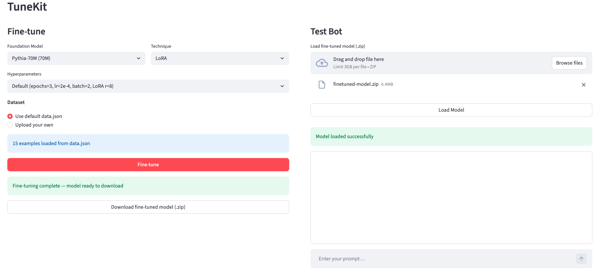

# TuneKit

Fine-tune a small language model on your own dataset and test it — all from a simple browser UI. No code required.

## Main page


---

## Supported Models

| Model | Parameters | HuggingFace ID |
|---|---|---|
| DeepSeek-R1 | 1.5B | `deepseek-ai/DeepSeek-R1-Distill-Qwen-1.5B` |
| Qwen2.5 | 1.5B | `Qwen/Qwen2.5-1.5B` |
| SmolLM2 | 1.7B | `HuggingFaceTB/SmolLM2-1.7B` |

All models download automatically from Hugging Face on first use.

## Fine-tuning Techniques

| Technique | Description |
|---|---|
| **LoRA** | Trains a small set of adapter weights (~1% of params). Fast, low memory. |
| **QLoRA** | LoRA on a 4-bit quantized model. Lowest memory — requires a CUDA GPU. |
| **Prefix Tuning** | Prepends trainable tokens to the input. No model weights modified. |
| **Full Fine-tuning** | Updates all model parameters. Highest quality, highest memory. |

---

## Project Structure

```
tunekit/
├── pyproject.toml
├── data.json                   ← sample training data
└── src/tunekit/
    ├── trainer.py              ← fine-tuning logic (LoRA, QLoRA, Prefix Tuning, Full)
    ├── bot.py                  ← inference / chat logic
    └── app.py                  ← Streamlit UI
```

---

## Requirements

- Python 3.10+
- [uv](https://docs.astral.sh/uv/) package manager
- CUDA GPU — required only for QLoRA (MPS/CPU supported for all other techniques)

---

## Setup

**1. Install uv** (if not already installed):

```bash
# macOS / Linux
curl -LsSf https://astral.sh/uv/install.sh | sh

# or via Homebrew
brew install uv
```

**2. Clone and enter the project directory:**

```bash
cd /path/to/tunekit
```

**3. Create a virtual environment and install dependencies:**

```bash
uv venv
source .venv/bin/activate       # macOS / Linux
# .venv\Scripts\activate        # Windows

uv pip install -e .
```

---

## Running the App

```bash
tunekit
```

Then open your browser at **http://localhost:8501**.

---

## Using the UI

### Left panel — Fine-tune

1. **Select a model** — choose from DeepSeek-R1, Qwen2.5, or SmolLM2.
2. **Select a technique** — LoRA, QLoRA, Prefix Tuning, or Full Fine-tuning.
3. **Choose hyperparameters** — pick a preset (Default / Fast / High Quality).
4. **Load training data** — use the bundled `data.json` or upload your own JSON file.
5. **Click Fine-tune** — training runs in the background with a live progress bar.

When training finishes, the model is saved to `./finetuned-model/` and a `.zip` download is offered.

### Right panel — Test Bot

1. **Upload the `.zip`** produced after training, then click **Load Model**.
2. **Type a prompt** in the chat input and press Enter.
3. The bot responds using the fine-tuned model.

---

## Training Data Format

`data.json` is a list of instruction/response pairs:

```json
[
  {
    "instruction": "What is the capital of France?",
    "response": "The capital of France is Paris."
  },
  {
    "instruction": "Explain machine learning in one sentence.",
    "response": "Machine learning is a method of teaching computers to learn patterns from data."
  }
]
```

A minimum of 2 examples is required. You can upload your own file via the UI.
